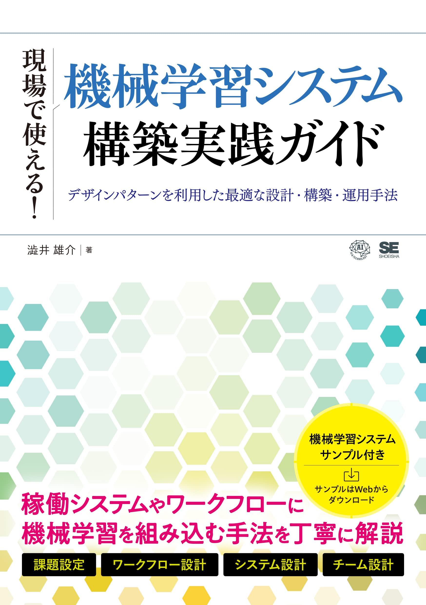

# 「[現場で使える!機械学習システム構築実践ガイド デザインパターンを利用した最適な設計・構築・運用手法](https://www.amazon.co.jp/%E7%8F%BE%E5%A0%B4%E3%81%A7%E4%BD%BF%E3%81%88%E3%82%8B-%E6%A9%9F%E6%A2%B0%E5%AD%A6%E7%BF%92%E3%82%B7%E3%82%B9%E3%83%86%E3%83%A0%E6%A7%8B%E7%AF%89%E5%AE%9F%E8%B7%B5%E3%82%AC%E3%82%A4%E3%83%89-%E3%83%87%E3%82%B6%E3%82%A4%E3%83%B3%E3%83%91%E3%82%BF%E3%83%BC%E3%83%B3%E3%82%92%E5%88%A9%E7%94%A8%E3%81%97%E3%81%9F%E6%9C%80%E9%81%A9%E3%81%AA%E8%A8%AD%E8%A8%88%E3%83%BB%E6%A7%8B%E7%AF%89%E3%83%BB%E9%81%8B%E7%94%A8%E6%89%8B%E6%B3%95-%E6%BE%81%E4%BA%95-%E9%9B%84%E4%BB%8B/dp/4798173401?&linkCode=ll1&tag=shibuiyusuke-22&linkId=6c46b03d1099edcb61988f6b37247ed8&language=ja_JP&ref_=as_li_ss_tl)」のためのサンプルプログラム

本レポジトリは2022年11月翔泳社出版「[現場で使える!機械学習システム構築実践ガイド デザインパターンを利用した最適な設計・構築・運用手法](https://www.amazon.co.jp/%E7%8F%BE%E5%A0%B4%E3%81%A7%E4%BD%BF%E3%81%88%E3%82%8B-%E6%A9%9F%E6%A2%B0%E5%AD%A6%E7%BF%92%E3%82%B7%E3%82%B9%E3%83%86%E3%83%A0%E6%A7%8B%E7%AF%89%E5%AE%9F%E8%B7%B5%E3%82%AC%E3%82%A4%E3%83%89-%E3%83%87%E3%82%B6%E3%82%A4%E3%83%B3%E3%83%91%E3%82%BF%E3%83%BC%E3%83%B3%E3%82%92%E5%88%A9%E7%94%A8%E3%81%97%E3%81%9F%E6%9C%80%E9%81%A9%E3%81%AA%E8%A8%AD%E8%A8%88%E3%83%BB%E6%A7%8B%E7%AF%89%E3%83%BB%E9%81%8B%E7%94%A8%E6%89%8B%E6%B3%95-%E6%BE%81%E4%BA%95-%E9%9B%84%E4%BB%8B/dp/4798173401?&linkCode=ll1&tag=shibuiyusuke-22&linkId=6c46b03d1099edcb61988f6b37247ed8&language=ja_JP&ref_=as_li_ss_tl)」のサンプルプログラム集です。 

本レポジトリではビジネス課題に応じて機械学習システムをEnd-to-endで自作します。 
以下システムを用意しています。

- [chapter2_demand_forecasting_with_ml](./chapter2_demand_forecasting_with_ml): 架空の飲料品販売店`AI商店`で飲料品の需要予測を実施します。
- [chapter3_4_aianimals](./chapter3_4_aianimals): 架空の動物画像投稿スマホアプリ`AIAnimals`で機械学習を活用します。

