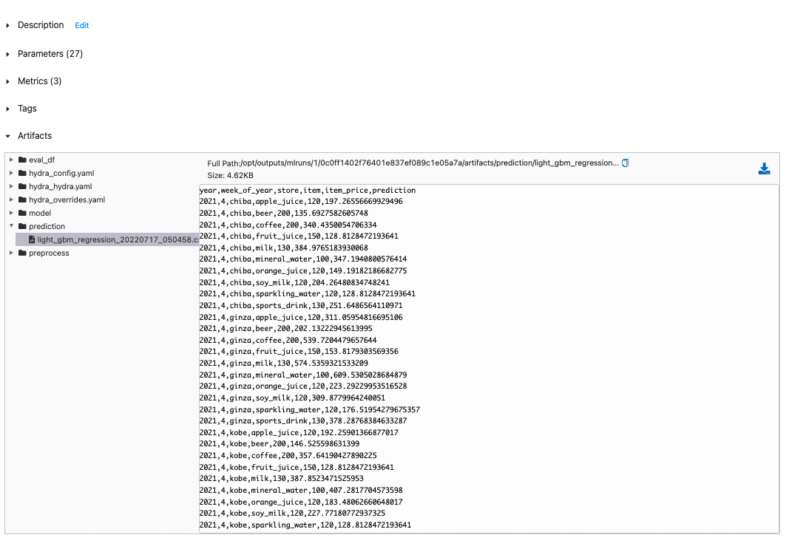

# Stage 0

Stage0ではローカル環境で飲料品の需要予測モデルを学習、評価、推論します。

- 以下のコマンドはすべてローカル端末で実行し、ローカル端末内で起動します。
- すべてのリソースはDockerコンテナとして起動します。
- 環境構築およびコマンドの実行はすべてLinuxおよびmacbookで稼働確認しています。

## 前提

このREADMEは2021年の第4週に実行することを想定して記述しています。
実行の対象週は [docker-compose.yaml](./docker-compose.yaml) の`ml`で環境変数で設定している`TARGET_CONFIG_NAME`で指定します。
指定可能な対象週は[ml/hydra](./ml/hydra/)ディレクトリに用意されているファイルになります。
[ml/hydra](./ml/hydra/)には以下が用意されています。

```sh
2020_52.yaml
2021_03.yaml
2021_04.yaml
2021_31.yaml
2021_32.yaml
```


## Requirements

- [Docker Engine](https://docs.docker.com/engine/install/)
- [Docker compose](https://docs.docker.jp/compose/install.html)
- makeコマンドの実行環境

## Components

- [MLflow tracking server](https://www.mlflow.org/docs/latest/index.html): 機械学習の学習結果を管理するサーバ。
- [PostgreSQL database](https://www.postgresql.org/): MLflowのデータを保存するデータベース。
- ml: 機械学習の学習、評価、推論を実行する。
- BI: [streamlit](https://streamlit.io/)で構築するBI環境。

## Getting started

### 1. Dockerイメージのビルド

Dockerイメージをビルドします。

- ビルドコマンドは `make build_all` です。

<details> <summary>Docker buildのログ</summary>

```sh
$ make build_all
docker build \
		--platform x86_64 \
		-t shibui/building-ml-system:beverage_sales_forecasting_ml_0.0.0 \
		-f /Users/shibuiyusuke/book2/building-ml-system/chapter2_demand_forecasting_with_ml/stage0/ml/Dockerfile \
		.
[+] Building 2.1s (11/11) FINISHED
 => [internal] load build definition from Dockerfile                                                                           0.0s
 => => transferring dockerfile: 449B                                                                                           0.0s
 => [internal] load .dockerignore                                                                                              0.0s
 => => transferring context: 2B                                                                                                0.0s
 => [internal] load metadata for docker.io/library/python:3.9.7-slim                                                           1.9s
 => [auth] library/python:pull token for registry-1.docker.io                                                                  0.0s
 => [1/5] FROM docker.io/library/python:3.9.7-slim@sha256:aef632387d994b410de020dfd08fb1d9b648fc8a5a44f332f7ee326c8e170dba     0.0s
 => [internal] load build context                                                                                              0.1s
 => => transferring context: 55.33kB                                                                                           0.0s
 => CACHED [2/5] WORKDIR /opt                                                                                                  0.0s
 => CACHED [3/5] COPY ml/requirements.txt /opt/                                                                                0.0s
 => CACHED [4/5] RUN apt-get -y update &&     apt-get -y install     apt-utils     gcc &&     apt-get clean &&     rm -rf /va  0.0s
 => [5/5] COPY ml/src/ /opt/src/                                                                                               0.0s
 => exporting to image                                                                                                         0.0s
 => => exporting layers                                                                                                        0.0s
 => => writing image sha256:78c95114269f9a026d50ce30582e0cb993d557b2b4bef1313a588fd4534c7e7f                                   0.0s
 => => naming to docker.io/shibui/building-ml-system:beverage_sales_forecasting_ml_0.0.0                                       0.0s

Use 'docker scan' to run Snyk tests against images to find vulnerabilities and learn how to fix them
docker build \
		--platform x86_64 \
		-t shibui/building-ml-system:beverage_sales_forecasting_mlflow_0.0.0 \
		-f /Users/shibuiyusuke/book2/building-ml-system/chapter2_demand_forecasting_with_ml/stage0/ml/Dockerfile.mlflow \
		.
[+] Building 133.7s (7/7) FINISHED
 => [internal] load build definition from Dockerfile.mlflow                                                                    0.0s
 => => transferring dockerfile: 342B                                                                                           0.0s
 => [internal] load .dockerignore                                                                                              0.0s
 => => transferring context: 2B                                                                                                0.0s
 => [internal] load metadata for docker.io/library/python:3.9-slim                                                             0.3s
 => [1/3] FROM docker.io/library/python:3.9-slim@sha256:ea93ec4fbe8ee1c62397410c0d1f342a33199e98cd59adac6964b38e410e8246       0.0s
 => CACHED [2/3] WORKDIR /opt                                                                                                  0.0s
 => [3/3] RUN pip install mlflow sqlalchemy psycopg2-binary                                                                  132.0s
 => exporting to image                                                                                                         1.2s
 => => exporting layers                                                                                                        1.2s
 => => writing image sha256:21265972f73eb3cef0fe788da0f5a456ad31ecd4be05617606c6fd279d201a49                                   0.0s
 => => naming to docker.io/shibui/building-ml-system:beverage_sales_forecasting_mlflow_0.0.0                                   0.0s

Use 'docker scan' to run Snyk tests against images to find vulnerabilities and learn how to fix them
docker build \
		--platform x86_64 \
		-t shibui/building-ml-system:beverage_sales_forecasting_bi_0.0.0 \
		-f /Users/shibuiyusuke/book2/building-ml-system/chapter2_demand_forecasting_with_ml/stage0/bi/Dockerfile \
		.
[+] Building 0.9s (10/10) FINISHED
 => [internal] load build definition from Dockerfile                                                                           0.0s
 => => transferring dockerfile: 492B                                                                                           0.0s
 => [internal] load .dockerignore                                                                                              0.0s
 => => transferring context: 2B                                                                                                0.0s
 => [internal] load metadata for docker.io/library/python:3.9.7-slim                                                           0.8s
 => [internal] load build context                                                                                              0.0s
 => => transferring context: 34.77kB                                                                                           0.0s
 => [1/5] FROM docker.io/library/python:3.9.7-slim@sha256:aef632387d994b410de020dfd08fb1d9b648fc8a5a44f332f7ee326c8e170dba     0.0s
 => CACHED [2/5] WORKDIR /opt                                                                                                  0.0s
 => CACHED [3/5] COPY bi/requirements.txt /opt/                                                                                0.0s
 => CACHED [4/5] RUN apt-get -y update &&     apt-get -y install     apt-utils     gcc &&     apt-get clean &&     rm -rf /va  0.0s
 => CACHED [5/5] COPY bi/src/ /opt/src/                                                                                        0.0s
 => exporting to image                                                                                                         0.0s
 => => exporting layers                                                                                                        0.0s
 => => writing image sha256:858ff346c111d51aa7d9dfb5fdae8a4f15d24543a2872baa5675b868d037706b                                   0.0s
 => => naming to docker.io/shibui/building-ml-system:beverage_sales_forecasting_bi_0.0.0                                       0.0s

Use 'docker scan' to run Snyk tests against images to find vulnerabilities and learn how to fix them

```

</details>

### 2. 学習

飲料品の需要予測モデルを学習、評価、推論します。

- `make up` で環境構築および学習、評価、推論が一括して実行されます。

<details> <summary>学習のログ</summary>

```sh
# 機械学習および管理環境の起動
$ make up
docker-compose \
	-f docker-compose.yaml \
	up -d
Creating network "ml" with the default driver
Creating postgres ... done
Creating mlflow   ... done
Creating ml       ... done

# 起動したリソースの確認
$ docker ps -a
CONTAINER ID   IMAGE                                                               COMMAND                  CREATED         STATUS         PORTS                                         NAMES
45a5fb80c0d2   shibui/building-ml-system:beverage_sales_forecasting_ml_0.0.0       "/bin/sh -c 'sleep 1…"   6 seconds ago   Up 5 seconds                                                 ml
5aa78dcfd535   shibui/building-ml-system:beverage_sales_forecasting_mlflow_0.0.0   "mlflow server --bac…"   6 seconds ago   Up 6 seconds   0.0.0.0:15000->5000/tcp, :::15000->5000/tcp   mlflow
9a878ee682b1   postgres:14.3                                                       "docker-entrypoint.s…"   7 seconds ago   Up 6 seconds   0.0.0.0:5432->5432/tcp, :::5432->5432/tcp     postgres

# 学習ログ
$ docker logs -f ml
[2022-07-17 05:03:04,575][__main__][INFO] - start ml...
[2022-07-17 05:03:04,575][__main__][INFO] - config: {'name': 'beverage_sales_forecasting', 'jobs': {'data': {'source': 'local', 'path': '/opt/data/data/item_sales_records_train_2021_04.csv', 'target_data': {'date_from': '2017-01-01', 'date_to': '2021-01-18', 'item': 'ALL', 'store': 'ALL', 'region': 'ALL'}, 'train': {'year': 2017, 'week': 1}, 'test': {'year': 2021, 'week': 2}, 'predict': {'year': 2021, 'week': 4, 'items': 'ALL', 'stores': 'ALL'}}, 'model': {'name': 'light_gbm_regression', 'params': {'task': 'train', 'boosting': 'gbdt', 'objective': 'regression', 'num_leaves': 3, 'learning_rate': 0.05, 'feature_fraction': 0.5, 'max_depth': -1, 'num_iterations': 1000000, 'num_threads': 0, 'seed': 1234, 'early_stopping_rounds': 200, 'eval_metrics': 'mse', 'verbose_eval': 1000}}, 'train': {'run': True}, 'predict': {'run': True, 'register': True}}}
[2022-07-17 05:03:04,575][__main__][INFO] - current working directory: /opt/outputs/2022-07-17/05-03-04
[2022-07-17 05:03:04,575][__main__][INFO] - run_name: 2022-07-17-05-03-04
2022/07/17 05:03:04 INFO mlflow.tracking.fluent: Experiment with name 'beverage_sales_forecasting' does not exist. Creating a new experiment.
2022/07/17 05:03:05 WARNING mlflow.tracking.context.git_context: Failed to import Git (the Git executable is probably not on your PATH), so Git SHA is not available. Error: Failed to initialize: Bad git executable.
The git executable must be specified in one of the following ways:
    - be included in your $PATH
    - be set via $GIT_PYTHON_GIT_EXECUTABLE
    - explicitly set via git.refresh()

All git commands will error until this is rectified.

This initial warning can be silenced or aggravated in the future by setting the
$GIT_PYTHON_REFRESH environment variable. Use one of the following values:
    - quiet|q|silence|s|none|n|0: for no warning or exception
    - warn|w|warning|1: for a printed warning
    - error|e|raise|r|2: for a raised exception

Example:
    export GIT_PYTHON_REFRESH=quiet

[2022-07-17 05:03:05,521][src.models.preprocess][INFO] - init pipeline
[2022-07-17 05:03:05,577][src.models.preprocess][INFO] - pipeline: ColumnTransformer(transformers=[('bare',
                                 Pipeline(steps=[('simple_imputer',
                                                  SimpleImputer(strategy='constant'))]),
                                 ['store', 'item', 'year', 'week_of_year',
                                  'sales']),
                                ('lag',
                                 Pipeline(steps=[('simple_imputer',
                                                  SimpleImputer(strategy='constant'))]),
                                 ['sales_lag_2', 'sales_lag_3', 'sales_lag_4',
                                  'sales_lag_5', 'sales_lag_6', 'sales_lag_7',
                                  'sales_lag_8', 'sales_lag_9...
                                                 ('one_hot_encoder',
                                                  FunctionTransformer(func=<bound method OneHotEncoder.transform of OneHotEncoder(handle_unknown='ignore')>))]),
                                 ['month']),
                                ('year',
                                 Pipeline(steps=[('simple_imputer',
                                                  SimpleImputer(strategy='constant')),
                                                 ('one_hot_encoder',
                                                  FunctionTransformer(func=<bound method OneHotEncoder.transform of OneHotEncoder(handle_unknown='ignore')>))]),
                                 ['year'])])
[2022-07-17 05:03:05,578][src.jobs.retrieve][INFO] - start retrieve data
[2022-07-17 05:03:05,578][src.dataset.data_manager][INFO] - load dataframe from /opt/data/data/item_sales_records_train_2021_04.csv
[2022-07-17 05:03:06,089][src.jobs.retrieve][INFO] -
Loaded dataset
raw_df columns: Index(['date', 'day_of_week', 'week_of_year', 'store', 'item', 'sales',
       'total_sales_amount', 'item_price'],
      dtype='object')
raw_df shape: (147900, 8)
date from: 2017-01-01 00:00:00
date to: 2021-01-18 00:00:00

[2022-07-17 05:03:06,103][__main__][INFO] - "
raw data
             date day_of_week  ...  total_sales_amount item_price
0      2017-01-01         SUN  ...                3480        120
1      2017-01-01         SUN  ...                3000        200
2      2017-01-01         SUN  ...                5200        200
3      2017-01-01         SUN  ...                3900        150
4      2017-01-01         SUN  ...                4940        130
...           ...         ...  ...                 ...        ...
147895 2021-01-18         MON  ...                7900        100
147896 2021-01-18         MON  ...                3000        120
147897 2021-01-18         MON  ...                5400        120
147898 2021-01-18         MON  ...                1920        120
147899 2021-01-18         MON  ...                6240        130

[147900 rows x 8 columns]

[2022-07-17 05:03:06,103][src.jobs.retrieve][INFO] -
Split dataset
train: 2017 1 to 2021 1
test: 2021 2

[2022-07-17 05:03:06,632][src.jobs.retrieve][INFO] -
weekly train df columns: Index(['year', 'week_of_year', 'store', 'item', 'month', 'item_price', 'sales',
       'total_sales_amount', 'sales_lag_2', 'sales_lag_3', 'sales_lag_4',
       'sales_lag_5', 'sales_lag_6', 'sales_lag_7', 'sales_lag_8',
       'sales_lag_9', 'sales_lag_10', 'sales_lag_11', 'sales_lag_12',
       'sales_lag_13', 'sales_lag_14', 'sales_lag_15', 'sales_lag_16',
       'sales_lag_17', 'sales_lag_18', 'sales_lag_19', 'sales_lag_20',
       'sales_lag_21', 'sales_lag_22', 'sales_lag_23', 'sales_lag_24',
       'sales_lag_25', 'sales_lag_26', 'sales_lag_27', 'sales_lag_28',
       'sales_lag_29', 'sales_lag_30', 'sales_lag_31', 'sales_lag_32',
       'sales_lag_33', 'sales_lag_34', 'sales_lag_35', 'sales_lag_36',
       'sales_lag_37', 'sales_lag_38', 'sales_lag_39', 'sales_lag_40',
       'sales_lag_41', 'sales_lag_42', 'sales_lag_43', 'sales_lag_44',
       'sales_lag_45', 'sales_lag_46', 'sales_lag_47', 'sales_lag_48',
       'sales_lag_49', 'sales_lag_50', 'sales_lag_51', 'sales_lag_52',
       'sales_lag_53'],
      dtype='object')
weekly train df shape: (21000, 60)
weekly test df columns: Index(['year', 'week_of_year', 'store', 'item', 'month', 'item_price', 'sales',
       'total_sales_amount', 'sales_lag_2', 'sales_lag_3', 'sales_lag_4',
       'sales_lag_5', 'sales_lag_6', 'sales_lag_7', 'sales_lag_8',
       'sales_lag_9', 'sales_lag_10', 'sales_lag_11', 'sales_lag_12',
       'sales_lag_13', 'sales_lag_14', 'sales_lag_15', 'sales_lag_16',
       'sales_lag_17', 'sales_lag_18', 'sales_lag_19', 'sales_lag_20',
       'sales_lag_21', 'sales_lag_22', 'sales_lag_23', 'sales_lag_24',
       'sales_lag_25', 'sales_lag_26', 'sales_lag_27', 'sales_lag_28',
       'sales_lag_29', 'sales_lag_30', 'sales_lag_31', 'sales_lag_32',
       'sales_lag_33', 'sales_lag_34', 'sales_lag_35', 'sales_lag_36',
       'sales_lag_37', 'sales_lag_38', 'sales_lag_39', 'sales_lag_40',
       'sales_lag_41', 'sales_lag_42', 'sales_lag_43', 'sales_lag_44',
       'sales_lag_45', 'sales_lag_46', 'sales_lag_47', 'sales_lag_48',
       'sales_lag_49', 'sales_lag_50', 'sales_lag_51', 'sales_lag_52',
       'sales_lag_53'],
      dtype='object')
weekly test df shape: (100, 60)

[2022-07-17 05:03:06,984][src.models.preprocess][INFO] - store_categories: ['store_chiba', 'store_ginza', 'store_kobe', 'store_morioka', 'store_nagoya', 'store_osaka', 'store_sendai', 'store_shinjuku', 'store_ueno', 'store_yokohama']
[2022-07-17 05:03:06,984][src.models.preprocess][INFO] - item_categories: ['item_apple_juice', 'item_beer', 'item_coffee', 'item_fruit_juice', 'item_milk', 'item_mineral_water', 'item_orange_juice', 'item_soy_milk', 'item_sparkling_water', 'item_sports_drink']
[2022-07-17 05:03:06,984][src.models.preprocess][INFO] - preprocessed_columns: ['store', 'item', 'year', 'week_of_year', 'sales', 'sales_lag_2', 'sales_lag_3', 'sales_lag_4', 'sales_lag_5', 'sales_lag_6', 'sales_lag_7', 'sales_lag_8', 'sales_lag_9', 'sales_lag_10', 'sales_lag_11', 'sales_lag_12', 'sales_lag_13', 'sales_lag_14', 'sales_lag_15', 'sales_lag_16', 'sales_lag_17', 'sales_lag_18', 'sales_lag_19', 'sales_lag_20', 'sales_lag_21', 'sales_lag_22', 'sales_lag_23', 'sales_lag_24', 'sales_lag_25', 'sales_lag_26', 'sales_lag_27', 'sales_lag_28', 'sales_lag_29', 'sales_lag_30', 'sales_lag_31', 'sales_lag_32', 'sales_lag_33', 'sales_lag_34', 'sales_lag_35', 'sales_lag_36', 'sales_lag_37', 'sales_lag_38', 'sales_lag_39', 'sales_lag_40', 'sales_lag_41', 'sales_lag_42', 'sales_lag_43', 'sales_lag_44', 'sales_lag_45', 'sales_lag_46', 'sales_lag_47', 'sales_lag_48', 'sales_lag_49', 'sales_lag_50', 'sales_lag_51', 'sales_lag_52', 'sales_lag_53', 'item_price', 'store_chiba', 'store_ginza', 'store_kobe', 'store_morioka', 'store_nagoya', 'store_osaka', 'store_sendai', 'store_shinjuku', 'store_ueno', 'store_yokohama', 'item_apple_juice', 'item_beer', 'item_coffee', 'item_fruit_juice', 'item_milk', 'item_mineral_water', 'item_orange_juice', 'item_soy_milk', 'item_sparkling_water', 'item_sports_drink', 'week_of_year_1', 'week_of_year_2', 'week_of_year_3', 'week_of_year_4', 'week_of_year_5', 'week_of_year_6', 'week_of_year_7', 'week_of_year_8', 'week_of_year_9', 'week_of_year_10', 'week_of_year_11', 'week_of_year_12', 'week_of_year_13', 'week_of_year_14', 'week_of_year_15', 'week_of_year_16', 'week_of_year_17', 'week_of_year_18', 'week_of_year_19', 'week_of_year_20', 'week_of_year_21', 'week_of_year_22', 'week_of_year_23', 'week_of_year_24', 'week_of_year_25', 'week_of_year_26', 'week_of_year_27', 'week_of_year_28', 'week_of_year_29', 'week_of_year_30', 'week_of_year_31', 'week_of_year_32', 'week_of_year_33', 'week_of_year_34', 'week_of_year_35', 'week_of_year_36', 'week_of_year_37', 'week_of_year_38', 'week_of_year_39', 'week_of_year_40', 'week_of_year_41', 'week_of_year_42', 'week_of_year_43', 'week_of_year_44', 'week_of_year_45', 'week_of_year_46', 'week_of_year_47', 'week_of_year_48', 'week_of_year_49', 'week_of_year_50', 'week_of_year_51', 'week_of_year_52', 'week_of_year_53', 'month_1', 'month_2', 'month_3', 'month_4', 'month_5', 'month_6', 'month_7', 'month_8', 'month_9', 'month_10', 'month_11', 'month_12', 'year_2017', 'year_2018', 'year_2019', 'year_2020', 'year_2021', 'year_2022', 'year_2023', 'year_2024', 'year_2025', 'year_2026', 'year_2027', 'year_2028', 'year_2029', 'year_2030']
[2022-07-17 05:03:06,984][src.models.preprocess][INFO] - preprocessed_types: {'store': 'str', 'item': 'str', 'year': 'int', 'week_of_year': 'int', 'sales': 'float64', 'sales_lag_2': 'float64', 'sales_lag_3': 'float64', 'sales_lag_4': 'float64', 'sales_lag_5': 'float64', 'sales_lag_6': 'float64', 'sales_lag_7': 'float64', 'sales_lag_8': 'float64', 'sales_lag_9': 'float64', 'sales_lag_10': 'float64', 'sales_lag_11': 'float64', 'sales_lag_12': 'float64', 'sales_lag_13': 'float64', 'sales_lag_14': 'float64', 'sales_lag_15': 'float64', 'sales_lag_16': 'float64', 'sales_lag_17': 'float64', 'sales_lag_18': 'float64', 'sales_lag_19': 'float64', 'sales_lag_20': 'float64', 'sales_lag_21': 'float64', 'sales_lag_22': 'float64', 'sales_lag_23': 'float64', 'sales_lag_24': 'float64', 'sales_lag_25': 'float64', 'sales_lag_26': 'float64', 'sales_lag_27': 'float64', 'sales_lag_28': 'float64', 'sales_lag_29': 'float64', 'sales_lag_30': 'float64', 'sales_lag_31': 'float64', 'sales_lag_32': 'float64', 'sales_lag_33': 'float64', 'sales_lag_34': 'float64', 'sales_lag_35': 'float64', 'sales_lag_36': 'float64', 'sales_lag_37': 'float64', 'sales_lag_38': 'float64', 'sales_lag_39': 'float64', 'sales_lag_40': 'float64', 'sales_lag_41': 'float64', 'sales_lag_42': 'float64', 'sales_lag_43': 'float64', 'sales_lag_44': 'float64', 'sales_lag_45': 'float64', 'sales_lag_46': 'float64', 'sales_lag_47': 'float64', 'sales_lag_48': 'float64', 'sales_lag_49': 'float64', 'sales_lag_50': 'float64', 'sales_lag_51': 'float64', 'sales_lag_52': 'float64', 'sales_lag_53': 'float64', 'item_price': 'float64', 'store_chiba': 'float64', 'store_ginza': 'float64', 'store_kobe': 'float64', 'store_morioka': 'float64', 'store_nagoya': 'float64', 'store_osaka': 'float64', 'store_sendai': 'float64', 'store_shinjuku': 'float64', 'store_ueno': 'float64', 'store_yokohama': 'float64', 'item_apple_juice': 'float64', 'item_beer': 'float64', 'item_coffee': 'float64', 'item_fruit_juice': 'float64', 'item_milk': 'float64', 'item_mineral_water': 'float64', 'item_orange_juice': 'float64', 'item_soy_milk': 'float64', 'item_sparkling_water': 'float64', 'item_sports_drink': 'float64', 'week_of_year_1': 'float64', 'week_of_year_2': 'float64', 'week_of_year_3': 'float64', 'week_of_year_4': 'float64', 'week_of_year_5': 'float64', 'week_of_year_6': 'float64', 'week_of_year_7': 'float64', 'week_of_year_8': 'float64', 'week_of_year_9': 'float64', 'week_of_year_10': 'float64', 'week_of_year_11': 'float64', 'week_of_year_12': 'float64', 'week_of_year_13': 'float64', 'week_of_year_14': 'float64', 'week_of_year_15': 'float64', 'week_of_year_16': 'float64', 'week_of_year_17': 'float64', 'week_of_year_18': 'float64', 'week_of_year_19': 'float64', 'week_of_year_20': 'float64', 'week_of_year_21': 'float64', 'week_of_year_22': 'float64', 'week_of_year_23': 'float64', 'week_of_year_24': 'float64', 'week_of_year_25': 'float64', 'week_of_year_26': 'float64', 'week_of_year_27': 'float64', 'week_of_year_28': 'float64', 'week_of_year_29': 'float64', 'week_of_year_30': 'float64', 'week_of_year_31': 'float64', 'week_of_year_32': 'float64', 'week_of_year_33': 'float64', 'week_of_year_34': 'float64', 'week_of_year_35': 'float64', 'week_of_year_36': 'float64', 'week_of_year_37': 'float64', 'week_of_year_38': 'float64', 'week_of_year_39': 'float64', 'week_of_year_40': 'float64', 'week_of_year_41': 'float64', 'week_of_year_42': 'float64', 'week_of_year_43': 'float64', 'week_of_year_44': 'float64', 'week_of_year_45': 'float64', 'week_of_year_46': 'float64', 'week_of_year_47': 'float64', 'week_of_year_48': 'float64', 'week_of_year_49': 'float64', 'week_of_year_50': 'float64', 'week_of_year_51': 'float64', 'week_of_year_52': 'float64', 'week_of_year_53': 'float64', 'month_1': 'float64', 'month_2': 'float64', 'month_3': 'float64', 'month_4': 'float64', 'month_5': 'float64', 'month_6': 'float64', 'month_7': 'float64', 'month_8': 'float64', 'month_9': 'float64', 'month_10': 'float64', 'month_11': 'float64', 'month_12': 'float64', 'year_2017': 'float64', 'year_2018': 'float64', 'year_2019': 'float64', 'year_2020': 'float64', 'year_2021': 'float64', 'year_2022': 'float64', 'year_2023': 'float64', 'year_2024': 'float64', 'year_2025': 'float64', 'year_2026': 'float64', 'year_2027': 'float64', 'year_2028': 'float64', 'year_2029': 'float64', 'year_2030': 'float64'}
[2022-07-17 05:03:08,161][src.models.preprocess][INFO] - preprocessed_columns: ['store', 'item', 'year', 'week_of_year', 'sales', 'sales_lag_2', 'sales_lag_3', 'sales_lag_4', 'sales_lag_5', 'sales_lag_6', 'sales_lag_7', 'sales_lag_8', 'sales_lag_9', 'sales_lag_10', 'sales_lag_11', 'sales_lag_12', 'sales_lag_13', 'sales_lag_14', 'sales_lag_15', 'sales_lag_16', 'sales_lag_17', 'sales_lag_18', 'sales_lag_19', 'sales_lag_20', 'sales_lag_21', 'sales_lag_22', 'sales_lag_23', 'sales_lag_24', 'sales_lag_25', 'sales_lag_26', 'sales_lag_27', 'sales_lag_28', 'sales_lag_29', 'sales_lag_30', 'sales_lag_31', 'sales_lag_32', 'sales_lag_33', 'sales_lag_34', 'sales_lag_35', 'sales_lag_36', 'sales_lag_37', 'sales_lag_38', 'sales_lag_39', 'sales_lag_40', 'sales_lag_41', 'sales_lag_42', 'sales_lag_43', 'sales_lag_44', 'sales_lag_45', 'sales_lag_46', 'sales_lag_47', 'sales_lag_48', 'sales_lag_49', 'sales_lag_50', 'sales_lag_51', 'sales_lag_52', 'sales_lag_53', 'item_price', 'store_chiba', 'store_ginza', 'store_kobe', 'store_morioka', 'store_nagoya', 'store_osaka', 'store_sendai', 'store_shinjuku', 'store_ueno', 'store_yokohama', 'item_apple_juice', 'item_beer', 'item_coffee', 'item_fruit_juice', 'item_milk', 'item_mineral_water', 'item_orange_juice', 'item_soy_milk', 'item_sparkling_water', 'item_sports_drink', 'week_of_year_1', 'week_of_year_2', 'week_of_year_3', 'week_of_year_4', 'week_of_year_5', 'week_of_year_6', 'week_of_year_7', 'week_of_year_8', 'week_of_year_9', 'week_of_year_10', 'week_of_year_11', 'week_of_year_12', 'week_of_year_13', 'week_of_year_14', 'week_of_year_15', 'week_of_year_16', 'week_of_year_17', 'week_of_year_18', 'week_of_year_19', 'week_of_year_20', 'week_of_year_21', 'week_of_year_22', 'week_of_year_23', 'week_of_year_24', 'week_of_year_25', 'week_of_year_26', 'week_of_year_27', 'week_of_year_28', 'week_of_year_29', 'week_of_year_30', 'week_of_year_31', 'week_of_year_32', 'week_of_year_33', 'week_of_year_34', 'week_of_year_35', 'week_of_year_36', 'week_of_year_37', 'week_of_year_38', 'week_of_year_39', 'week_of_year_40', 'week_of_year_41', 'week_of_year_42', 'week_of_year_43', 'week_of_year_44', 'week_of_year_45', 'week_of_year_46', 'week_of_year_47', 'week_of_year_48', 'week_of_year_49', 'week_of_year_50', 'week_of_year_51', 'week_of_year_52', 'week_of_year_53', 'month_1', 'month_2', 'month_3', 'month_4', 'month_5', 'month_6', 'month_7', 'month_8', 'month_9', 'month_10', 'month_11', 'month_12', 'year_2017', 'year_2018', 'year_2019', 'year_2020', 'year_2021', 'year_2022', 'year_2023', 'year_2024', 'year_2025', 'year_2026', 'year_2027', 'year_2028', 'year_2029', 'year_2030']
[2022-07-17 05:03:08,161][src.models.preprocess][INFO] - preprocessed_types: {'store': 'str', 'item': 'str', 'year': 'int', 'week_of_year': 'int', 'sales': 'float64', 'sales_lag_2': 'float64', 'sales_lag_3': 'float64', 'sales_lag_4': 'float64', 'sales_lag_5': 'float64', 'sales_lag_6': 'float64', 'sales_lag_7': 'float64', 'sales_lag_8': 'float64', 'sales_lag_9': 'float64', 'sales_lag_10': 'float64', 'sales_lag_11': 'float64', 'sales_lag_12': 'float64', 'sales_lag_13': 'float64', 'sales_lag_14': 'float64', 'sales_lag_15': 'float64', 'sales_lag_16': 'float64', 'sales_lag_17': 'float64', 'sales_lag_18': 'float64', 'sales_lag_19': 'float64', 'sales_lag_20': 'float64', 'sales_lag_21': 'float64', 'sales_lag_22': 'float64', 'sales_lag_23': 'float64', 'sales_lag_24': 'float64', 'sales_lag_25': 'float64', 'sales_lag_26': 'float64', 'sales_lag_27': 'float64', 'sales_lag_28': 'float64', 'sales_lag_29': 'float64', 'sales_lag_30': 'float64', 'sales_lag_31': 'float64', 'sales_lag_32': 'float64', 'sales_lag_33': 'float64', 'sales_lag_34': 'float64', 'sales_lag_35': 'float64', 'sales_lag_36': 'float64', 'sales_lag_37': 'float64', 'sales_lag_38': 'float64', 'sales_lag_39': 'float64', 'sales_lag_40': 'float64', 'sales_lag_41': 'float64', 'sales_lag_42': 'float64', 'sales_lag_43': 'float64', 'sales_lag_44': 'float64', 'sales_lag_45': 'float64', 'sales_lag_46': 'float64', 'sales_lag_47': 'float64', 'sales_lag_48': 'float64', 'sales_lag_49': 'float64', 'sales_lag_50': 'float64', 'sales_lag_51': 'float64', 'sales_lag_52': 'float64', 'sales_lag_53': 'float64', 'item_price': 'float64', 'store_chiba': 'float64', 'store_ginza': 'float64', 'store_kobe': 'float64', 'store_morioka': 'float64', 'store_nagoya': 'float64', 'store_osaka': 'float64', 'store_sendai': 'float64', 'store_shinjuku': 'float64', 'store_ueno': 'float64', 'store_yokohama': 'float64', 'item_apple_juice': 'float64', 'item_beer': 'float64', 'item_coffee': 'float64', 'item_fruit_juice': 'float64', 'item_milk': 'float64', 'item_mineral_water': 'float64', 'item_orange_juice': 'float64', 'item_soy_milk': 'float64', 'item_sparkling_water': 'float64', 'item_sports_drink': 'float64', 'week_of_year_1': 'float64', 'week_of_year_2': 'float64', 'week_of_year_3': 'float64', 'week_of_year_4': 'float64', 'week_of_year_5': 'float64', 'week_of_year_6': 'float64', 'week_of_year_7': 'float64', 'week_of_year_8': 'float64', 'week_of_year_9': 'float64', 'week_of_year_10': 'float64', 'week_of_year_11': 'float64', 'week_of_year_12': 'float64', 'week_of_year_13': 'float64', 'week_of_year_14': 'float64', 'week_of_year_15': 'float64', 'week_of_year_16': 'float64', 'week_of_year_17': 'float64', 'week_of_year_18': 'float64', 'week_of_year_19': 'float64', 'week_of_year_20': 'float64', 'week_of_year_21': 'float64', 'week_of_year_22': 'float64', 'week_of_year_23': 'float64', 'week_of_year_24': 'float64', 'week_of_year_25': 'float64', 'week_of_year_26': 'float64', 'week_of_year_27': 'float64', 'week_of_year_28': 'float64', 'week_of_year_29': 'float64', 'week_of_year_30': 'float64', 'week_of_year_31': 'float64', 'week_of_year_32': 'float64', 'week_of_year_33': 'float64', 'week_of_year_34': 'float64', 'week_of_year_35': 'float64', 'week_of_year_36': 'float64', 'week_of_year_37': 'float64', 'week_of_year_38': 'float64', 'week_of_year_39': 'float64', 'week_of_year_40': 'float64', 'week_of_year_41': 'float64', 'week_of_year_42': 'float64', 'week_of_year_43': 'float64', 'week_of_year_44': 'float64', 'week_of_year_45': 'float64', 'week_of_year_46': 'float64', 'week_of_year_47': 'float64', 'week_of_year_48': 'float64', 'week_of_year_49': 'float64', 'week_of_year_50': 'float64', 'week_of_year_51': 'float64', 'week_of_year_52': 'float64', 'week_of_year_53': 'float64', 'month_1': 'float64', 'month_2': 'float64', 'month_3': 'float64', 'month_4': 'float64', 'month_5': 'float64', 'month_6': 'float64', 'month_7': 'float64', 'month_8': 'float64', 'month_9': 'float64', 'month_10': 'float64', 'month_11': 'float64', 'month_12': 'float64', 'year_2017': 'float64', 'year_2018': 'float64', 'year_2019': 'float64', 'year_2020': 'float64', 'year_2021': 'float64', 'year_2022': 'float64', 'year_2023': 'float64', 'year_2024': 'float64', 'year_2025': 'float64', 'year_2026': 'float64', 'year_2027': 'float64', 'year_2028': 'float64', 'year_2029': 'float64', 'year_2030': 'float64'}
[2022-07-17 05:03:08,331][src.jobs.retrieve][INFO] -
preprocessed train df columns: Index(['store', 'item', 'year', 'week_of_year', 'sales', 'sales_lag_2',
       'sales_lag_3', 'sales_lag_4', 'sales_lag_5', 'sales_lag_6',
       ...
       'year_2021', 'year_2022', 'year_2023', 'year_2024', 'year_2025',
       'year_2026', 'year_2027', 'year_2028', 'year_2029', 'year_2030'],
      dtype='object', length=157)
preprocessed train df shape: (21000, 157)
preprocessed test df columns: Index(['store', 'item', 'year', 'week_of_year', 'sales', 'sales_lag_2',
       'sales_lag_3', 'sales_lag_4', 'sales_lag_5', 'sales_lag_6',
       ...
       'year_2021', 'year_2022', 'year_2023', 'year_2024', 'year_2025',
       'year_2026', 'year_2027', 'year_2028', 'year_2029', 'year_2030'],
      dtype='object', length=157)
preprocessed test df shape: (100, 157)

[2022-07-17 05:03:09,349][src.jobs.retrieve][INFO] -
x_train shape: (21000, 154)
y_train shape: (21000, 1)
x_test shape: (100, 154)
y_test shape: (100, 1)

[2022-07-17 05:03:09,349][src.jobs.retrieve][INFO] - done split data
[2022-07-17 05:03:10,124][src.models.light_gbm_regression][INFO] - params: {'task': 'train', 'boosting': 'gbdt', 'objective': 'regression', 'num_leaves': 3, 'learning_rate': 0.05, 'feature_fraction': 0.5, 'max_depth': -1, 'num_iterations': 1000000, 'num_threads': 0, 'seed': 1234}
[2022-07-17 05:03:10,125][src.models.light_gbm_regression][INFO] - initialized model: LGBMRegressor(boosting='gbdt', feature_fraction=0.5, learning_rate=0.05,
              num_iterations=1000000, num_leaves=3, num_threads=0,
              objective='regression', seed=1234, task='train')
[2022-07-17 05:03:10,125][src.models.light_gbm_regression][INFO] - params: {'task': 'train', 'boosting': 'gbdt', 'objective': 'regression', 'num_leaves': 3, 'learning_rate': 0.05, 'feature_fraction': 0.5, 'max_depth': -1, 'num_iterations': 1000000, 'num_threads': 0, 'seed': 1234, 'early_stopping_rounds': 200, 'eval_metrics': 'mse', 'verbose_eval': 1000}
[2022-07-17 05:03:10,126][src.models.light_gbm_regression][INFO] - initialized model: LGBMRegressor(boosting='gbdt', early_stopping_rounds=200, eval_metrics='mse',
              feature_fraction=0.5, learning_rate=0.05, num_iterations=1000000,
              num_leaves=3, num_threads=0, objective='regression', seed=1234,
              task='train', verbose_eval=1000)
[2022-07-17 05:03:10,126][src.jobs.train][INFO] - start training and evaluation
[2022-07-17 05:03:10,127][src.models.light_gbm_regression][INFO] - start train for model: LGBMRegressor(boosting='gbdt', early_stopping_rounds=200, eval_metrics='mse',
              feature_fraction=0.5, learning_rate=0.05, num_iterations=1000000,
              num_leaves=3, num_threads=0, objective='regression', seed=1234,
              task='train', verbose_eval=1000)
/usr/local/lib/python3.9/site-packages/lightgbm/sklearn.py:726: UserWarning: 'early_stopping_rounds' argument is deprecated and will be removed in a future release of LightGBM. Pass 'early_stopping()' callback via 'callbacks' argument instead.
  _log_warning("'early_stopping_rounds' argument is deprecated and will be removed in a future release of LightGBM. "
/usr/local/lib/python3.9/site-packages/lightgbm/sklearn.py:736: UserWarning: 'verbose' argument is deprecated and will be removed in a future release of LightGBM. Pass 'log_evaluation()' callback via 'callbacks' argument instead.
  _log_warning("'verbose' argument is deprecated and will be removed in a future release of LightGBM. "
/usr/local/lib/python3.9/site-packages/lightgbm/engine.py:177: UserWarning: Found `num_iterations` in params. Will use it instead of argument
  _log_warning(f"Found `{alias}` in params. Will use it instead of argument")
[LightGBM] [Warning] Unknown parameter: eval_metrics
[LightGBM] [Warning] Unknown parameter: verbose_eval
[LightGBM] [Warning] early_stopping_round is set=200, early_stopping_rounds=200 will be ignored. Current value: early_stopping_round=200
[LightGBM] [Warning] boosting is set=gbdt, boosting_type=gbdt will be ignored. Current value: boosting=gbdt
[LightGBM] [Warning] feature_fraction is set=0.5, colsample_bytree=1.0 will be ignored. Current value: feature_fraction=0.5
[LightGBM] [Warning] num_threads is set=0, n_jobs=-1 will be ignored. Current value: num_threads=0
[2022-07-17 05:03:10,566][src.jobs.train][INFO] - Evaluations
    year  week_of_year     store  ...      y_pred       diff  error_rate
0   2021             2     chiba  ...  190.622703 -12.622703   -0.070914
1   2021             2     chiba  ...  128.812847 -10.812847   -0.091634
2   2021             2     chiba  ...  271.908843  53.091157    0.163357
3   2021             2     chiba  ...  128.812847 -30.812847   -0.314417
4   2021             2     chiba  ...  306.114857  89.885143    0.226983
..   ...           ...       ...  ...         ...        ...         ...
95  2021             2  yokohama  ...  488.315785  34.684215    0.066318
96  2021             2  yokohama  ...  190.622703  21.377297    0.100836
97  2021             2  yokohama  ...  208.777461  69.222539    0.249002
98  2021             2  yokohama  ...  131.479070  -4.479070   -0.035268
99  2021             2  yokohama  ...  306.114857  18.885143    0.058108

[100 rows x 8 columns]
[2022-07-17 05:03:10,574][src.jobs.train][INFO] - Predicted too high; diff -50
      store             item  y_true      y_pred       diff
5     chiba    mineral_water   300.0  359.270308 -59.270308
31  morioka             beer    74.0  128.812847 -54.812847
33  morioka      fruit_juice    63.0  128.812847 -65.812847
38  morioka  sparkling_water    70.0  128.812847 -58.812847

[2022-07-17 05:03:10,584][src.jobs.train][INFO] - Predicted too low; diff 30
       store           item  y_true      y_pred        diff
2      chiba         coffee   325.0  271.908843   53.091157
4      chiba           milk   396.0  306.114857   89.885143
7      chiba       soy_milk   231.0  157.980720   73.019280
11     ginza           beer   214.0  170.175565   43.824435
12     ginza         coffee   539.0  453.359060   85.640940
14     ginza           milk   567.0  514.515468   52.484532
15     ginza  mineral_water   628.0  581.372987   46.627013
17     ginza       soy_milk   310.0  244.734279   65.265721
19     ginza   sports_drink   387.0  344.468121   42.531879
22      kobe         coffee   338.0  306.114857   31.885143
24      kobe           milk   383.0  331.153442   51.846558
27      kobe       soy_milk   230.0  153.428153   76.571847
42    nagoya         coffee   388.0  328.239055   59.760945
44    nagoya           milk   448.0  369.595400   78.404600
49    nagoya   sports_drink   286.0  252.340930   33.659070
52     osaka         coffee   505.0  414.722941   90.277059
54     osaka           milk   532.0  445.398713   86.601287
55     osaka  mineral_water   572.0  519.273664   52.726336
57     osaka       soy_milk   296.0  219.679974   76.320026
62    sendai         coffee   337.0  281.085082   55.914918
64    sendai           milk   368.0  322.497923   45.502077
71  shinjuku           beer   220.0  184.468846   35.531154
72  shinjuku         coffee   535.0  492.072888   42.927112
74  shinjuku           milk   610.0  514.515468   95.484532
77  shinjuku       soy_milk   332.0  263.203193   68.796807
79  shinjuku   sports_drink   383.0  323.221831   59.778169
82      ueno         coffee   480.0  408.165055   71.834945
84      ueno           milk   519.0  453.762209   65.237791
92  yokohama         coffee   471.0  351.616255  119.383745
94  yokohama           milk   502.0  426.726021   75.273979
95  yokohama  mineral_water   523.0  488.315785   34.684215
97  yokohama       soy_milk   278.0  208.777461   69.222539

[2022-07-17 05:03:10,585][src.jobs.train][INFO] - STORE nagoya
total diff: 124.18175395239541
average diff: 12.41817539523954

[2022-07-17 05:03:10,586][src.jobs.train][INFO] - STORE shinjuku
total diff: 314.6390472950234
average diff: 31.46390472950234

[2022-07-17 05:03:10,587][src.jobs.train][INFO] - STORE osaka
total diff: 318.28343236473575
average diff: 31.828343236473575

[2022-07-17 05:03:10,588][src.jobs.train][INFO] - STORE kobe
total diff: 127.4437057835662
average diff: 12.74437057835662

[2022-07-17 05:03:10,588][src.jobs.train][INFO] - STORE sendai
total diff: 34.751475806684766
average diff: 3.4751475806684766

[2022-07-17 05:03:10,589][src.jobs.train][INFO] - STORE chiba
total diff: 68.54343419155748
average diff: 6.854343419155748

[2022-07-17 05:03:10,590][src.jobs.train][INFO] - STORE morioka
total diff: -257.4836682402117
average diff: -25.748366824021172

[2022-07-17 05:03:10,590][src.jobs.train][INFO] - STORE ginza
total diff: 321.36684483466615
average diff: 32.13668448346662

[2022-07-17 05:03:10,591][src.jobs.train][INFO] - STORE yokohama
total diff: 323.8148903705005
average diff: 32.38148903705005

[2022-07-17 05:03:10,592][src.jobs.train][INFO] - STORE ueno
total diff: 189.2767983530739
average diff: 18.92767983530739

[2022-07-17 05:03:10,592][src.jobs.train][INFO] - ITEM fruit_juice
total diff: -190.08932285993
average diff: -19.008932285993

[2022-07-17 05:03:10,593][src.jobs.train][INFO] - ITEM apple_juice
total diff: -129.44667027119976
average diff: -12.944667027119976

[2022-07-17 05:03:10,594][src.jobs.train][INFO] - ITEM orange_juice
total diff: -21.36732234644387
average diff: -2.136732234644387

[2022-07-17 05:03:10,594][src.jobs.train][INFO] - ITEM sports_drink
total diff: 200.07669605910542
average diff: 20.007669605910543

[2022-07-17 05:03:10,595][src.jobs.train][INFO] - ITEM coffee
total diff: 614.5473934360907
average diff: 61.45473934360907

[2022-07-17 05:03:10,596][src.jobs.train][INFO] - ITEM milk
total diff: 653.7239398382417
average diff: 65.37239398382417

[2022-07-17 05:03:10,596][src.jobs.train][INFO] - ITEM mineral_water
total diff: 66.06928934059579
average diff: 6.606928934059579

[2022-07-17 05:03:10,597][src.jobs.train][INFO] - ITEM sparkling_water
total diff: -152.4392282481249
average diff: -15.24392282481249

[2022-07-17 05:03:10,598][src.jobs.train][INFO] - ITEM soy_milk
total diff: 466.1942669320763
average diff: 46.61942669320763

[2022-07-17 05:03:10,598][src.jobs.train][INFO] - ITEM beer
total diff: 57.54867283157955
average diff: 5.754867283157955

[2022-07-17 05:03:10,600][src.jobs.train][INFO] -
model: light_gbm_regression
mae: 32.72615241719336
mape: 0.14839261635784465
rmse: 42.62832327268464

[2022-07-17 05:03:10,600][src.models.preprocess][INFO] - save preprocess pipeline: /opt/outputs/2022-07-17/05-03-04/light_gbm_regression_20220717_050310.pkl
[2022-07-17 05:03:10,607][src.models.light_gbm_regression][INFO] - save model: /opt/outputs/2022-07-17/05-03-04/light_gbm_regression_20220717_050310.txt
[2022-07-17 05:03:10,608][src.jobs.train][INFO] - done training and evaluation
[2022-07-17 05:03:10,920][src.jobs.retrieve][INFO] - start retrieve prediction data
[2022-07-17 05:03:10,970][src.jobs.retrieve][INFO] -
Loaded prediction dataset
columns: Index(['date', 'day_of_week', 'week_of_year', 'store', 'item', 'item_price',
       'sales', 'total_sales_amount'],
      dtype='object')
shape: (1300, 8)
date from: 2021-01-19
date to: 2021-01-31

[2022-07-17 05:03:11,107][src.jobs.predict][INFO] -
target_year: 2021
target_week: 4
target_items: ALL
target_stores: ALL

[2022-07-17 05:03:11,900][src.models.preprocess][INFO] - preprocessed_columns: ['store', 'item', 'year', 'week_of_year', 'sales', 'sales_lag_2', 'sales_lag_3', 'sales_lag_4', 'sales_lag_5', 'sales_lag_6', 'sales_lag_7', 'sales_lag_8', 'sales_lag_9', 'sales_lag_10', 'sales_lag_11', 'sales_lag_12', 'sales_lag_13', 'sales_lag_14', 'sales_lag_15', 'sales_lag_16', 'sales_lag_17', 'sales_lag_18', 'sales_lag_19', 'sales_lag_20', 'sales_lag_21', 'sales_lag_22', 'sales_lag_23', 'sales_lag_24', 'sales_lag_25', 'sales_lag_26', 'sales_lag_27', 'sales_lag_28', 'sales_lag_29', 'sales_lag_30', 'sales_lag_31', 'sales_lag_32', 'sales_lag_33', 'sales_lag_34', 'sales_lag_35', 'sales_lag_36', 'sales_lag_37', 'sales_lag_38', 'sales_lag_39', 'sales_lag_40', 'sales_lag_41', 'sales_lag_42', 'sales_lag_43', 'sales_lag_44', 'sales_lag_45', 'sales_lag_46', 'sales_lag_47', 'sales_lag_48', 'sales_lag_49', 'sales_lag_50', 'sales_lag_51', 'sales_lag_52', 'sales_lag_53', 'item_price', 'store_chiba', 'store_ginza', 'store_kobe', 'store_morioka', 'store_nagoya', 'store_osaka', 'store_sendai', 'store_shinjuku', 'store_ueno', 'store_yokohama', 'item_apple_juice', 'item_beer', 'item_coffee', 'item_fruit_juice', 'item_milk', 'item_mineral_water', 'item_orange_juice', 'item_soy_milk', 'item_sparkling_water', 'item_sports_drink', 'week_of_year_1', 'week_of_year_2', 'week_of_year_3', 'week_of_year_4', 'week_of_year_5', 'week_of_year_6', 'week_of_year_7', 'week_of_year_8', 'week_of_year_9', 'week_of_year_10', 'week_of_year_11', 'week_of_year_12', 'week_of_year_13', 'week_of_year_14', 'week_of_year_15', 'week_of_year_16', 'week_of_year_17', 'week_of_year_18', 'week_of_year_19', 'week_of_year_20', 'week_of_year_21', 'week_of_year_22', 'week_of_year_23', 'week_of_year_24', 'week_of_year_25', 'week_of_year_26', 'week_of_year_27', 'week_of_year_28', 'week_of_year_29', 'week_of_year_30', 'week_of_year_31', 'week_of_year_32', 'week_of_year_33', 'week_of_year_34', 'week_of_year_35', 'week_of_year_36', 'week_of_year_37', 'week_of_year_38', 'week_of_year_39', 'week_of_year_40', 'week_of_year_41', 'week_of_year_42', 'week_of_year_43', 'week_of_year_44', 'week_of_year_45', 'week_of_year_46', 'week_of_year_47', 'week_of_year_48', 'week_of_year_49', 'week_of_year_50', 'week_of_year_51', 'week_of_year_52', 'week_of_year_53', 'month_1', 'month_2', 'month_3', 'month_4', 'month_5', 'month_6', 'month_7', 'month_8', 'month_9', 'month_10', 'month_11', 'month_12', 'year_2017', 'year_2018', 'year_2019', 'year_2020', 'year_2021', 'year_2022', 'year_2023', 'year_2024', 'year_2025', 'year_2026', 'year_2027', 'year_2028', 'year_2029', 'year_2030']
[2022-07-17 05:03:11,900][src.models.preprocess][INFO] - preprocessed_types: {'store': 'str', 'item': 'str', 'year': 'int', 'week_of_year': 'int', 'sales': 'float64', 'sales_lag_2': 'float64', 'sales_lag_3': 'float64', 'sales_lag_4': 'float64', 'sales_lag_5': 'float64', 'sales_lag_6': 'float64', 'sales_lag_7': 'float64', 'sales_lag_8': 'float64', 'sales_lag_9': 'float64', 'sales_lag_10': 'float64', 'sales_lag_11': 'float64', 'sales_lag_12': 'float64', 'sales_lag_13': 'float64', 'sales_lag_14': 'float64', 'sales_lag_15': 'float64', 'sales_lag_16': 'float64', 'sales_lag_17': 'float64', 'sales_lag_18': 'float64', 'sales_lag_19': 'float64', 'sales_lag_20': 'float64', 'sales_lag_21': 'float64', 'sales_lag_22': 'float64', 'sales_lag_23': 'float64', 'sales_lag_24': 'float64', 'sales_lag_25': 'float64', 'sales_lag_26': 'float64', 'sales_lag_27': 'float64', 'sales_lag_28': 'float64', 'sales_lag_29': 'float64', 'sales_lag_30': 'float64', 'sales_lag_31': 'float64', 'sales_lag_32': 'float64', 'sales_lag_33': 'float64', 'sales_lag_34': 'float64', 'sales_lag_35': 'float64', 'sales_lag_36': 'float64', 'sales_lag_37': 'float64', 'sales_lag_38': 'float64', 'sales_lag_39': 'float64', 'sales_lag_40': 'float64', 'sales_lag_41': 'float64', 'sales_lag_42': 'float64', 'sales_lag_43': 'float64', 'sales_lag_44': 'float64', 'sales_lag_45': 'float64', 'sales_lag_46': 'float64', 'sales_lag_47': 'float64', 'sales_lag_48': 'float64', 'sales_lag_49': 'float64', 'sales_lag_50': 'float64', 'sales_lag_51': 'float64', 'sales_lag_52': 'float64', 'sales_lag_53': 'float64', 'item_price': 'float64', 'store_chiba': 'float64', 'store_ginza': 'float64', 'store_kobe': 'float64', 'store_morioka': 'float64', 'store_nagoya': 'float64', 'store_osaka': 'float64', 'store_sendai': 'float64', 'store_shinjuku': 'float64', 'store_ueno': 'float64', 'store_yokohama': 'float64', 'item_apple_juice': 'float64', 'item_beer': 'float64', 'item_coffee': 'float64', 'item_fruit_juice': 'float64', 'item_milk': 'float64', 'item_mineral_water': 'float64', 'item_orange_juice': 'float64', 'item_soy_milk': 'float64', 'item_sparkling_water': 'float64', 'item_sports_drink': 'float64', 'week_of_year_1': 'float64', 'week_of_year_2': 'float64', 'week_of_year_3': 'float64', 'week_of_year_4': 'float64', 'week_of_year_5': 'float64', 'week_of_year_6': 'float64', 'week_of_year_7': 'float64', 'week_of_year_8': 'float64', 'week_of_year_9': 'float64', 'week_of_year_10': 'float64', 'week_of_year_11': 'float64', 'week_of_year_12': 'float64', 'week_of_year_13': 'float64', 'week_of_year_14': 'float64', 'week_of_year_15': 'float64', 'week_of_year_16': 'float64', 'week_of_year_17': 'float64', 'week_of_year_18': 'float64', 'week_of_year_19': 'float64', 'week_of_year_20': 'float64', 'week_of_year_21': 'float64', 'week_of_year_22': 'float64', 'week_of_year_23': 'float64', 'week_of_year_24': 'float64', 'week_of_year_25': 'float64', 'week_of_year_26': 'float64', 'week_of_year_27': 'float64', 'week_of_year_28': 'float64', 'week_of_year_29': 'float64', 'week_of_year_30': 'float64', 'week_of_year_31': 'float64', 'week_of_year_32': 'float64', 'week_of_year_33': 'float64', 'week_of_year_34': 'float64', 'week_of_year_35': 'float64', 'week_of_year_36': 'float64', 'week_of_year_37': 'float64', 'week_of_year_38': 'float64', 'week_of_year_39': 'float64', 'week_of_year_40': 'float64', 'week_of_year_41': 'float64', 'week_of_year_42': 'float64', 'week_of_year_43': 'float64', 'week_of_year_44': 'float64', 'week_of_year_45': 'float64', 'week_of_year_46': 'float64', 'week_of_year_47': 'float64', 'week_of_year_48': 'float64', 'week_of_year_49': 'float64', 'week_of_year_50': 'float64', 'week_of_year_51': 'float64', 'week_of_year_52': 'float64', 'week_of_year_53': 'float64', 'month_1': 'float64', 'month_2': 'float64', 'month_3': 'float64', 'month_4': 'float64', 'month_5': 'float64', 'month_6': 'float64', 'month_7': 'float64', 'month_8': 'float64', 'month_9': 'float64', 'month_10': 'float64', 'month_11': 'float64', 'month_12': 'float64', 'year_2017': 'float64', 'year_2018': 'float64', 'year_2019': 'float64', 'year_2020': 'float64', 'year_2021': 'float64', 'year_2022': 'float64', 'year_2023': 'float64', 'year_2024': 'float64', 'year_2025': 'float64', 'year_2026': 'float64', 'year_2027': 'float64', 'year_2028': 'float64', 'year_2029': 'float64', 'year_2030': 'float64'}
[2022-07-17 05:03:13,068][src.jobs.predict][INFO] - filter data
[2022-07-17 05:03:13,084][src.jobs.predict][INFO] -
Filtered prediction target data
filtered df columns: Index(['store', 'item', 'year', 'week_of_year', 'sales', 'sales_lag_2',
       'sales_lag_3', 'sales_lag_4', 'sales_lag_5', 'sales_lag_6',
       ...
       'year_2021', 'year_2022', 'year_2023', 'year_2024', 'year_2025',
       'year_2026', 'year_2027', 'year_2028', 'year_2029', 'year_2030'],
      dtype='object', length=157)
filtered df shape: (100, 157)

[2022-07-17 05:03:13,364][src.jobs.predict][INFO] - filter data
[2022-07-17 05:03:13,371][src.jobs.predict][INFO] -
Filtered prediction target data
filtered df columns: Index(['year', 'week_of_year', 'store', 'item', 'month', 'item_price', 'sales',
       'total_sales_amount', 'sales_lag_2', 'sales_lag_3', 'sales_lag_4',
       'sales_lag_5', 'sales_lag_6', 'sales_lag_7', 'sales_lag_8',
       'sales_lag_9', 'sales_lag_10', 'sales_lag_11', 'sales_lag_12',
       'sales_lag_13', 'sales_lag_14', 'sales_lag_15', 'sales_lag_16',
       'sales_lag_17', 'sales_lag_18', 'sales_lag_19', 'sales_lag_20',
       'sales_lag_21', 'sales_lag_22', 'sales_lag_23', 'sales_lag_24',
       'sales_lag_25', 'sales_lag_26', 'sales_lag_27', 'sales_lag_28',
       'sales_lag_29', 'sales_lag_30', 'sales_lag_31', 'sales_lag_32',
       'sales_lag_33', 'sales_lag_34', 'sales_lag_35', 'sales_lag_36',
       'sales_lag_37', 'sales_lag_38', 'sales_lag_39', 'sales_lag_40',
       'sales_lag_41', 'sales_lag_42', 'sales_lag_43', 'sales_lag_44',
       'sales_lag_45', 'sales_lag_46', 'sales_lag_47', 'sales_lag_48',
       'sales_lag_49', 'sales_lag_50', 'sales_lag_51', 'sales_lag_52',
       'sales_lag_53'],
      dtype='object')
filtered df shape: (100, 60)

/opt/src/jobs/predict.py:52: SettingWithCopyWarning:
A value is trying to be set on a copy of a slice from a DataFrame.
Try using .loc[row_indexer,col_indexer] = value instead

See the caveats in the documentation: https://pandas.pydata.org/pandas-docs/stable/user_guide/indexing.html#returning-a-view-versus-a-copy
  df["prediction"] = predictions
[2022-07-17 05:03:13,508][src.jobs.predict][INFO] -
predicted df columns: Index(['year', 'week_of_year', 'store', 'item', 'item_price', 'prediction'], dtype='object')
predicted df shape: (100, 6)

[2022-07-17 05:03:13,516][__main__][INFO] - predictions:        year  week_of_year     store             item  item_price  prediction
21200  2021             4     chiba      apple_juice         120  197.265567
21201  2021             4     chiba             beer         200  135.692758
21202  2021             4     chiba           coffee         200  340.435005
21203  2021             4     chiba      fruit_juice         150  128.812847
21204  2021             4     chiba             milk         130  384.976518
...     ...           ...       ...              ...         ...         ...
21295  2021             4  yokohama    mineral_water         100  531.309956
21296  2021             4  yokohama     orange_juice         120  214.987701
21297  2021             4  yokohama         soy_milk         120  278.069747
21298  2021             4  yokohama  sparkling_water         120  143.134621
21299  2021             4  yokohama     sports_drink         130  345.316111

[100 rows x 6 columns]
[2022-07-17 05:03:13,523][src.jobs.register][INFO] - save prediction as csv: /opt/outputs/2022-07-17/05-03-04/light_gbm_regression_20220717_050310.csv
```

</details>

### 3. 学習結果の確認

学習結果はMLfllow tracking serverに記録されています。
また、streamlitで構築したBI環境を起動することで、評価や推論結果を可視化することができます。

- MLflow tracking serverは `2. 学習` で起動済みです。
- BI環境は `make run_bi` で起動します。

<details> <summary>Docker buildのログ</summary>

```sh
# BI環境の起動
$ make run_bi
docker build \
		--platform x86_64 \
		-t shibui/building-ml-system:beverage_sales_forecasting_bi_0.0.0 \
		-f /Users/shibuiyusuke/book2/building-ml-system/chapter2_demand_forecasting_with_ml/stage0/bi/Dockerfile \
		.
[+] Building 1.8s (11/11) FINISHED
 => [internal] load build definition from Dockerfile                                                                           0.0s
 => => transferring dockerfile: 37B                                                                                            0.0s
 => [internal] load .dockerignore                                                                                              0.0s
 => => transferring context: 2B                                                                                                0.0s
 => [internal] load metadata for docker.io/library/python:3.9.7-slim                                                           1.7s
 => [auth] library/python:pull token for registry-1.docker.io                                                                  0.0s
 => [internal] load build context                                                                                              0.0s
 => => transferring context: 380B                                                                                              0.0s
 => [1/5] FROM docker.io/library/python:3.9.7-slim@sha256:aef632387d994b410de020dfd08fb1d9b648fc8a5a44f332f7ee326c8e170dba     0.0s
 => CACHED [2/5] WORKDIR /opt                                                                                                  0.0s
 => CACHED [3/5] COPY bi/requirements.txt /opt/                                                                                0.0s
 => CACHED [4/5] RUN apt-get -y update &&     apt-get -y install     apt-utils     gcc &&     apt-get clean &&     rm -rf /va  0.0s
 => CACHED [5/5] COPY bi/src/ /opt/src/                                                                                        0.0s
 => exporting to image                                                                                                         0.0s
 => => exporting layers                                                                                                        0.0s
 => => writing image sha256:858ff346c111d51aa7d9dfb5fdae8a4f15d24543a2872baa5675b868d037706b                                   0.0s
 => => naming to docker.io/shibui/building-ml-system:beverage_sales_forecasting_bi_0.0.0                                       0.0s

Use 'docker scan' to run Snyk tests against images to find vulnerabilities and learn how to fix them
docker run \
		-it \
		-d \
		--name bi \
		-p 8501:8501 \
		-v /Users/shibuiyusuke/book2/building-ml-system/chapter2_demand_forecasting_with_ml/stage0/data:/opt/data \
		-e ITEM_SALES_RECORD_FILE=/opt/data/data/item_sales_records_train_2021_04.csv \
		-e ITEM_SALES_PREDICTION_DIR=/opt/data/prediction \
		shibui/building-ml-system:beverage_sales_forecasting_bi_0.0.0 \
		streamlit run src/main.py
WARNING: The requested image's platform (linux/amd64) does not match the detected host platform (linux/arm64/v8) and no specific platform was requested
08e9a2859722bcdc76e102d0280867f37937dfad2d72cb3c4775cd6936274b3a
```

- なお、BIで読み込む販売実績は環境変数`ITEM_SALES_RECORD_FILE`で`/opt/data/data/item_sales_records_train_2021_04.csv`と指定しています。この環境変数で読み込むファイルは[data/data/item_sales_records_train_2021_04.csv](./data/data/item_sales_records_train_2021_04.csv)になります。
- 異なる期間の販売実績を指定したい場合は[data/data/](./data/data/)ディレクトリ配下にあるファイルを環境変数`ITEM_SALES_RECORD_FILE`に指定してください。

</details>

#### MLflow tracking server

- URL: http://localhost:15000/

トップページ


学習時のパラメータ


推論結果


#### BI by streamlit

- URL: http://localhost:8501

販売実績


販売実績対推論結果の評価

